 

[whokashmiri](https://whokashmiri.dev) · [instagram](https://www.instagram.com/whokashmiri/) · [linkedin](https://www.linkedin.com/in/whokashmiri/) · [email](aaqibmir.ab@gmail.com)

> Software Engineer / Freedom / Kashmir.
> Flowers to Funerals we have seen it all.

I’m a full-stack Software Engineer focused on building practical, production-style applications and strengthening my backend engineering skills with Java and Spring Boot. Right now, I’m building LetsShop, an e-commerce backend where I’m working hands-on with authentication, MongoDB, Redis, Kafka, REST APIs, and scalable backend architecture.
Link your current project: [LetsShop](https://github.com/whokashmiri/LetsShop) — A production-style e-commerce backend built with Java and Spring Boot, featuring secure authentication, product and cart management, Redis caching/rate limiting, and Kafka-based event-driven processing.

`python` `javascript` `typescript` `react` `node` `git` `linux` `Java` `Spring-boot` `Bash` `AWS` `redis` `kafka` `docker` `mongodb` `sql` `salesforce`

**[LetsShop](https://github.com/whokashmiri/LetsShop)** · `Java ,Spring boot` 
Full-featured e-commerce backend with JWT authentication, product catalog, cart, orders, reviews, inventory management, and Moyasar payments..

**[DriverHelpFrontend](https://github.com/whokashmiri/DriverHelpFrontend)** · `typescript, react , socket-io`  
The application is built with React Native, Expo, Expo Router, and TypeScript and supports both Driver and Supervisor users in one application..

**[RealEstateHaraj](https://github.com/whokashmiri/RealEstateHaraj
)** · `python , node , scrapper`  
Scrapes the Haraj real-estate tag page, opens each visible ad in a new tab, captures post/user/comments GraphQL responses, reads seller phone from the contact modal, and saves one MongoDB document per post..

  

Every graphic here is generated, not embedded from anyone else's server.  
`ascii.svg` is a photo pushed through a character ramp; the stat graphics and
these section headings are drawn by [a scheduled action](.github/workflows/stats.yml)
straight from the GitHub GraphQL API, once a day, committing only what changed.

They animate with SMIL inside the SVG, because GitHub strips scripts from
READMEs. Nothing loads from a third party, so nothing can rate-limit or go dark.

The typeface is [JetBrains Mono](scripts/fonts), subset to just the characters
each graphic draws and inlined as base64.

Language totals cover public repositories only. `year.svg` uses the portrait's
character ramp: `:` `+` `#` `@`, quiet to loud.
